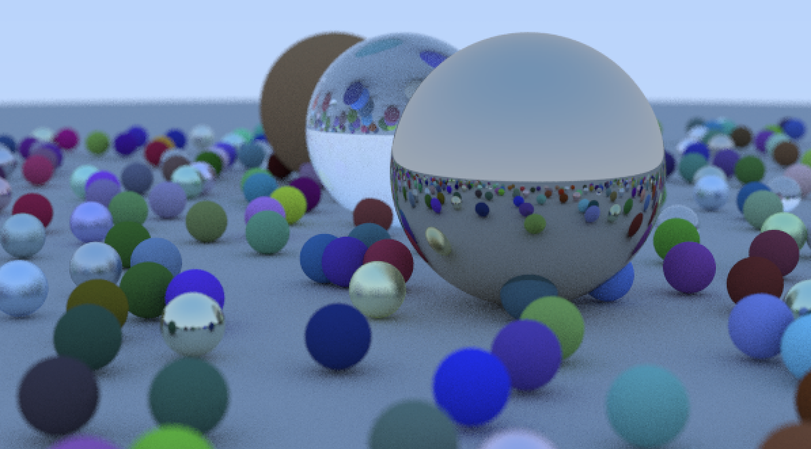
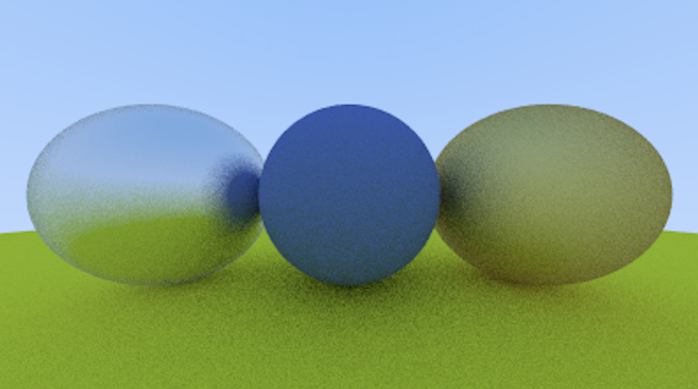

# Ray Tracer



This is an open-source ray tracing engine written in Python, designed for educational purposes and readability, with performance optimizations using Numpy. The engine supports complex materials like metal and glass and includes advanced features such as anti-aliasing and defocus blur.

* Note there are two versions of the raytracer in this repository, an incomplete one written in C++ from when I was learning how the raytracer itself worked and a complete one written in Python.

## Features

- **Complex Materials:** Support for reflective materials like metal and refractive materials like glass.
- **Advanced Rendering Techniques:** Includes anti-aliasing and defocus blur to produce smoother and more realistic images.
- **Scene Customization:** Easily customizable scenes with different objects, materials, and lighting setups.

## Getting Started

### Prerequisites

- Python 3.8 or higher
- Numpy

### Installation

1. Clone the repository:

   ```bash
   git clone https://github.com/darren-shen/ray-tracer.git
   cd ray-tracer

2. Install the required dependencies:

   ```bash
   pip install -r requirements.txt

## Running the Ray Tracer
To render a scene, simply run the main.py script:

```
python main.py
```

This will output an image file (output.png) in the project directory, showcasing a scene with various objects and materials.

## Customizing the Scene
The scene configuration can be modified in scene.py. You can add or remove objects, change their materials, or adjust the lighting and camera settings to create your unique scenes.


### Example: Adding a new sphere to the scene

```
#### Create a new sphere
new_sphere = Sphere(center=[0, -1, -3], radius=1, material=Metal(albedo=[0.8, 0.6, 0.2], fuzz=0.3))

#### Add it to the scene
scene_objects.append(new_sphere)
```

## Sample Renders
Here are some example images rendered using this engine:





## Contributing
Contributions are welcome! Please fork the repository and submit a pull request with your improvements.

## License
This project is licensed under the MIT License - see the LICENSE file for details.

## Acknowledgments
This project was inspired by Peter Shirley's "Ray Tracing in One Weekend" series, which provides a great introduction to the concepts behind ray tracing.

Feel free to adjust any details to better fit your project or preferences!
